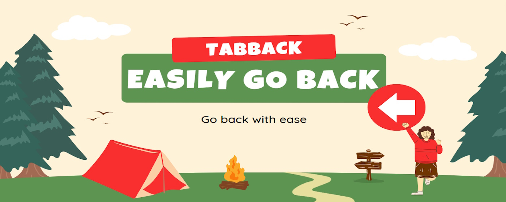

**Why TabBack Chrome Extension?**

🚀 **Effortlessly navigate your browsing galaxy** with the **Last TabBack Switcher Chrome Extension**. This isn't just any extension—it's your trusty starship in the vast internet cosmos. 🌌

**Features at Warp Speed:**

1. **Ctrl + Shift + Z (or Command + B on Mac)**: Your secret teleporter! Press this magical combo, and *poof!* You're back on your last visited tab. It's like Ctrl + Z for your browsing life. 🚪🔮

2. **Seamless Tracking**: Imagine a cosmic breadcrumb trail. This extension follows it. It knows where you've been, like a digital Sherlock with a magnifying glass. 🔍🔭

3. **Multitasker's Dream**: Got 37 tabs open? No problem. The Last Tab Switcher whispers, "Fear not, brave multitasker! Your most recent tab awaits." 🌟📑

4. **Streamline Your Odyssey**: No more tab-tango. No more lost constellations. Just one keystroke, and you're surfing the Milky Way like a pro. 🌠🏄‍♂️

So, fellow space traveler, buckle up. The Last TabBack Switcher awaits your command! 🛸💫
